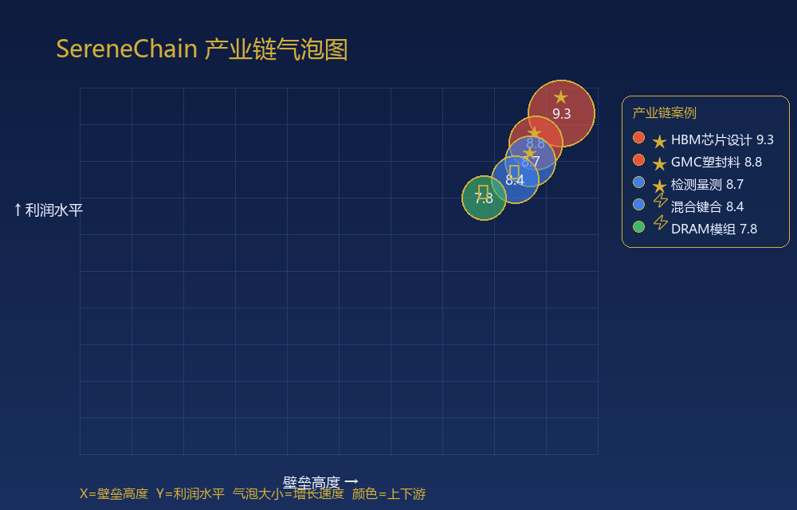

# 🔗 SereneChain 产业链拆解挖金

> 输入一个产业名，AI 自动帮你画出「挖金地图」——圈出最肥的环节、抓出下一个拐点、列出对应上市公司。
> 覆盖 **A股 / 港股 / 美股**，对话即用，无需写代码。

[](LICENSE)
[]()
[]()
[]()

---

## 🌟 为什么你需要它

看研报全是术语轰炸，钱到底卡在产业链哪一环？市场最不缺情绪，缺的是**不被情绪带跑的结构化视角**。

SereneChain 把复杂的产业链，变成一张你能立刻看懂、能拿去决策的「挖金地图」。

## 🚀 三步上手

1. 在支持 Skill 的 Agent（WorkBuddy / QClaw）安装本技能
2. 对话输入：`拆解 存储芯片`（换成任意产业名）
3. 拿到：全景图 + 三高筛选 + 边际拐点 + 气泡图 + 上市公司清单

## 🧠 核心方法论

| 步骤 | 干什么 | 产出 |
|------|--------|------|
| 1️⃣ 产业链图谱 | AI 构建上中下游，联网校验最新动态 | 全景结构图 |
| 2️⃣ 三高筛选 | 高壁垒 · 高利润 · 高增长 量化打分 | 最肥环节 |
| 3️⃣ 边际变化三维 ⭐ | 产品结构 / 盈利 / 估值 各打 1–10 分 | 拐点信号 ★⚡⚠ |
| 4️⃣ 公司深度分析 | 财务 + 格局 + 边际 + 催化时间表 | 标的清单 |
| 5️⃣ 气泡图可视化 | X=壁垒 Y=利润 气泡=增长 颜色=上下游 | 一图看懂 |

### 边际变化三维（我们的差异化招牌）
- **产品结构边际**：是否升级跨阶、毛利率黑匣子是否打开
- **盈利边际**：良率 / 产能是否破局，带来非线性拐点
- **估值边际**：下一代技术路线卡位，触发估值重构催化
- 综合打分 + 方向（↑↑ / ↑ / → / ↓）+ 标记：**★ 顶级 / ⚡ 拐点 / ⚠ 恶化**

## 📊 真实案例：存储芯片（HBM / DRAM 子链）

| 环节 | 三高评分 | 边际综合 | 信号 |
|------|:-------:|:-------:|:----:|
| HBM 芯片设计 | 9.3 | 9.3 | ★ 顶级 |
| GMC 塑封料 | 8.8 | 8.8 | ★ 顶级 |
| 检测量测 | 8.7 | 8.7 | ★ 顶级 |
| 混合键合 | 8.4 | 8.4 | ⚡ 拐点（估值重构级技术切换）|
| DRAM 模组 | 7.8 | 7.8 | ⚡ 拐点 |

> 不喊你冲，只帮你看得清。

## 🖼️ 效果预览



> 运行 `python scripts/generate_bubble_chart.py` 可基于你的数据生成上述气泡图（X=壁垒高度，Y=利润水平，气泡大小=增长速度，颜色区分上中下游，★⚡⚠ 标记边际信号）。

## 📁 目录结构

```
SereneChain 产业链拆解挖金/
├── SKILL.md                     # 技能主工作流（6 阶段 + Phase 3.5 边际分析）
├── README.md                    # 本文件
├── references/
│   ├── chain-framework.md       # 产业链方法论
│   ├── barrier-analysis.md      # 壁垒评估体系
│   ├── company-screening.md     # 公司筛选标准
│   └── margin-analysis.md       # 边际变化三维评估体系（含真实案例）
└── scripts/
    └── generate_bubble_chart.py # 气泡图生成脚本（plotly）
```

## 🔗 相关链接

- 🏠 **GitHub 仓库**：https://github.com/qq545722724-eng/serene-chain
- 🛒 **SkillHub（限时免费）**：搜索「SereneChain 产业链拆解挖金」
- 🌐 **引流介绍页**：`SereneChain_介绍页.html`（随发布包提供）

## ⭐ 如果对你有用

点个 **Star** ⭐ 让更多研究者看到；也欢迎提 Issue / PR 一起打磨这套方法论。

## 📄 License

[MIT](LICENSE)
